```{r setup, include=FALSE}
knitr::opts_chunk$set(warning = FALSE, message = FALSE, fig.height = 5)
library(ggplot2)
library(tidyverse)
library(rwars)
library(forcats)
library(ggthemes)

## What is the ratio of ships to vehicles in each movie?


films <- rwars::get_all_films()$results
results <- tibble(
  title = map_chr(films, "title"),
  episode = map_dbl(films, "episode_id"),
  starships = map_dbl(films, ~length(.x$starships)),
  vehicles = map_dbl(films, ~length(.x$vehicles)),
  planets = map_dbl(films, ~length(.x$planets))
) %>% 
  mutate(ratio = starships / (vehicles + starships) * 100) %>% 
  arrange(episode) %>% 
  mutate(Trilogy = c(rep("Prequels: Episode I-III", 3), rep("Originals: Epsiode IV-VI", 3), rep("Sequels: Episode VII", 1))) %>% 
  mutate(title = factor(title, levels = title))


p <- ggplot(results, aes(title, ratio)) + 
  labs(
    title = "The Rise of Hyperdrive",
    subtitle = "Percentage of Ships with Hyperdrive Capability"
  ) +
  scale_y_continuous(labels = function(x){paste(x,"%")}) +
  theme_fivethirtyeight() +
  scale_colour_fivethirtyeight() +
  theme(
    axis.text.x = element_text(angle = 35, vjust = 0.9, hjust = 0.9)
  )
```

## RStudio

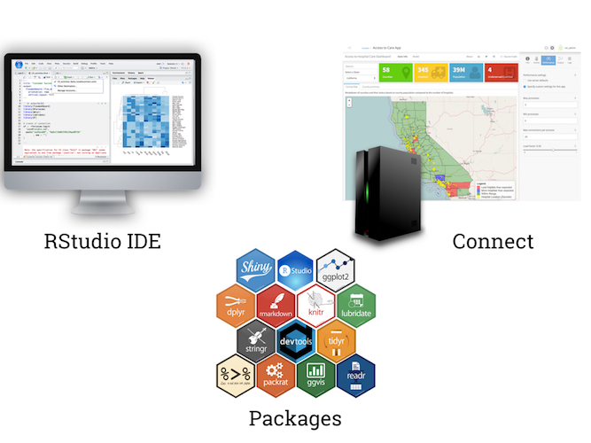

### "Open source and enterprise-ready professional software for R"

---
## How we think about Data Science

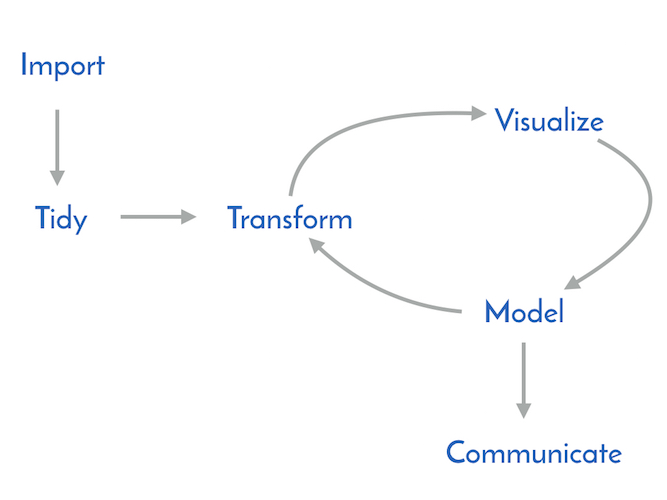

---
## How we think about Data Science

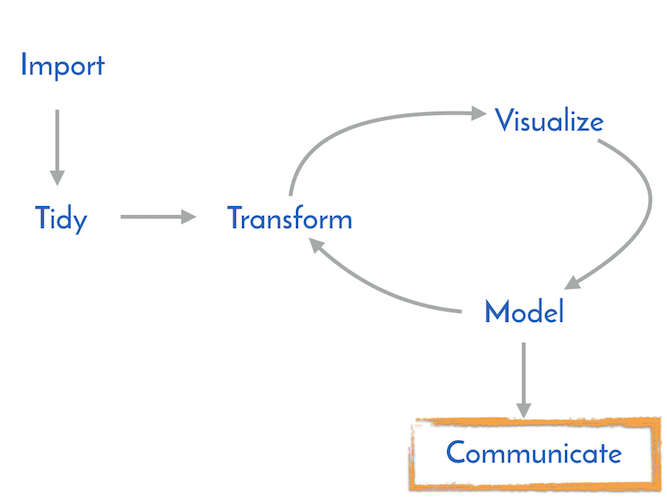

We'll cover some examples, talk a bit about R, and mostly share some tips.

---
name: disclaimer
## First, a disclaimer ...

---
template: disclaimer


Data accessible at http://swapi.com 

---
## Plots

```{r eval = TRUE, echo = FALSE}
library(ggplot2)
p + 
  geom_line(group = 1) + 
  geom_point(aes(color = Trilogy), stat = "identity", size = 4)
```

### Keep it simple

---
## Plots

```{r eval = TRUE, echo = FALSE}
library(ggplot2)
p + 
  geom_point(aes(color = Trilogy, x = planets, y = ratio), size = 5) +
  labs(
    title = "The Rise of Hyperdrive",
    subtitle = "% of Ships vs Number of Planets"
  ) +
  theme(
    axis.text.x = element_text()
  )
```

### Counter-example

---
## Plots

```{r eval = TRUE, echo = TRUE}
library(ggplot2)
p + geom_bar(aes(fill = Trilogy), stat = "identity", size = 4)
```
### Fail Fast & Iterate Quickly

---
## Plots

```{r eval = FALSE, echo = TRUE}
library(ggplot2)
p + geom_line(group = 1) + geom_point(aes(color = Trilogy))
```

```{r eval = TRUE, echo = FALSE}
library(ggplot2)
p + geom_line(group = 1) + geom_point(aes(color = Trilogy), stat = "identity", size = 4)
```

### Fail Fast & Iterate Quickly

---
## Notebooks


### Scientists use lab notebooks. Data *scientists* should use notebooks too

---
class: inverse, center, middle

# Demo

???

Open notebook in rstudio
http://colorado.rstudio.com/s/e2976ca6f1c73d79f7cb4/
Metion version control?
Preview notebook -> publish -> download Rmd

---
## Notebooks

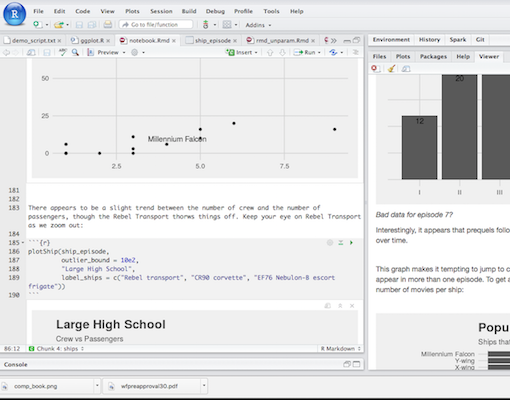

### Reproducibility of code & thought process!

---
## Reports


---
## Reports

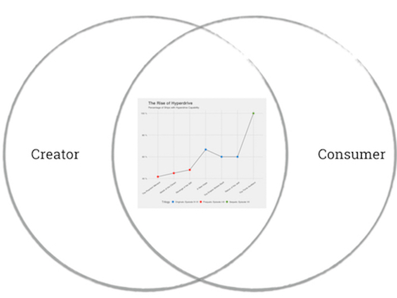

---
## Reports

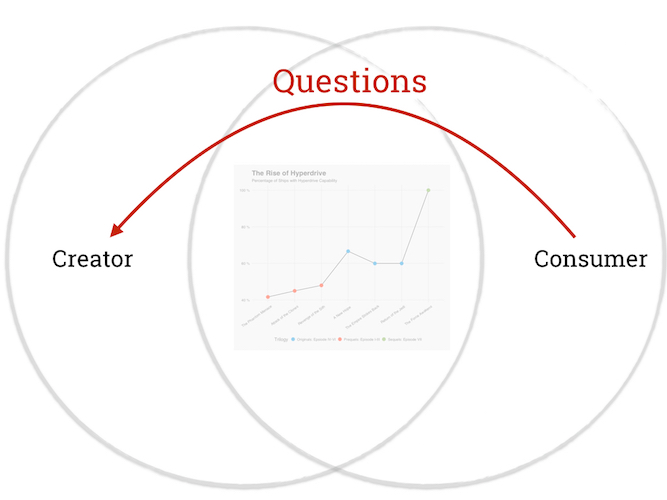

### A problem ... 

---
## Reports

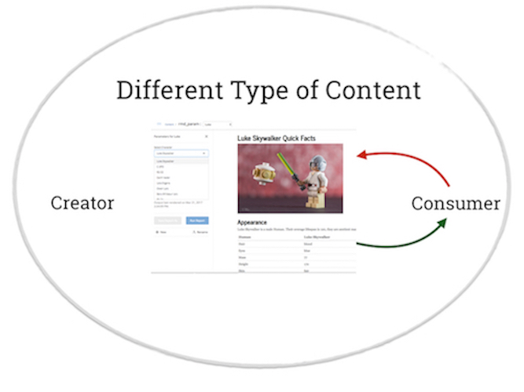
---
## Reports

Avoid Copy + Paste

Avoid Find + Replace

### Develop Functionally

---
class: middle, inverse, center

# Demo

### Parameterized R Markdown

???

Hop to RStudio first to show code
http://roadshow.rstudio.com/connect/#/apps/16


---
## Interactivity

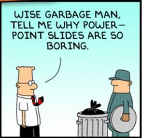


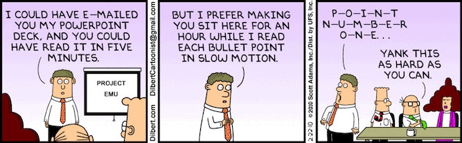

---
## Interactivity 1: htmlwidgets

```{r echo = FALSE, warning=FALSE}
hyperdrive_plot <- p + geom_line(group = 1) + geom_point(aes(color = Trilogy), stat = "identity", size = 4)
```

```{r echo=TRUE, eval = TRUE}
library(plotly)
ggplotly(hyperdrive_plot)
```

---
## Interactivity 2: Applications

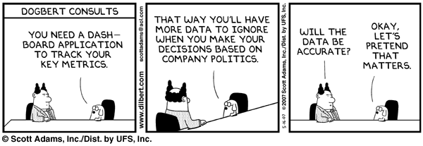

### Tools exist to make it easy to create dashboards and web apps!

---
class: center, middle, inverse

# Demo 

### flexdashboard, runtime:shiny

???

http://roadshow.rstudio.com/content/17/

---
## In Summary

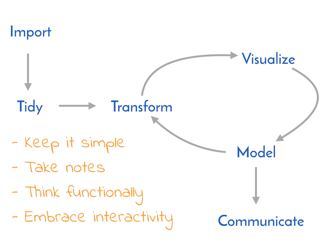


